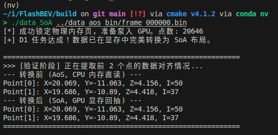
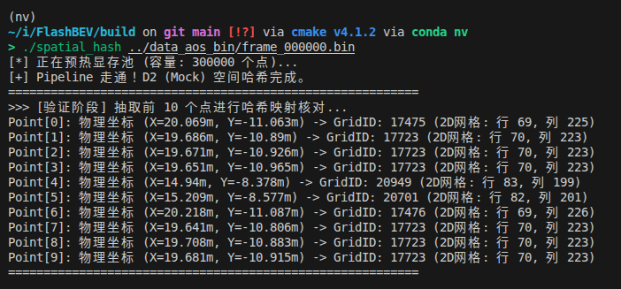
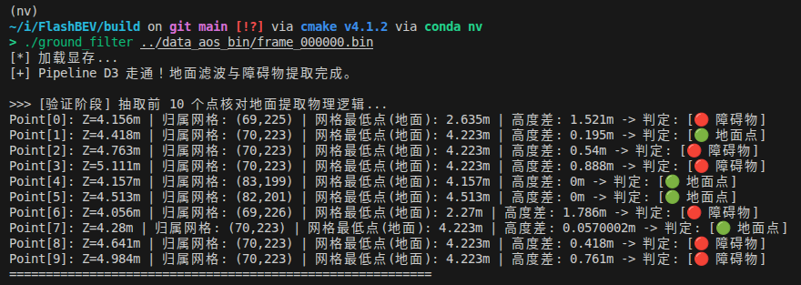
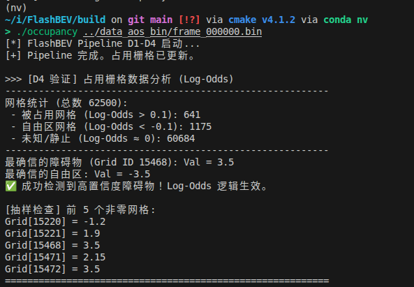
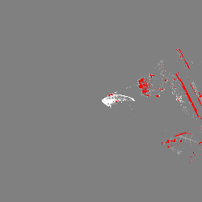
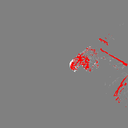

# FlashBEV: High-Performance CUDA LiDAR-to-BEV Perception Map

FlashBEV 是一个基于纯 C++17 与 CUDA 驱动开发的轻量级、高性能激光雷达至鸟瞰图（LiDAR-to-BEV）占用栅格系统。本项目剥离了冗长的深度学习框架与庞杂的外部依赖，专注于底层显存级优化、时空同步映射与极致的并行计算吞吐率，适用于对计算延迟有严格要求的机器人与自动驾驶感知模块。
每一个核心功能都在./script/目录下写了main函数并加到CMakeLists中生成可执行文件来测试功能

## 1 数据准备与布局转换 (Data Preparation & Memory Layout)



针对传感器数据流水线，本项目重点优化了数据加载与内存布局：
由于测试设备限制，原始数据采用 Python 从 rosbag 中提取 LiDAR 消息，并紧密排布为 **AoS (Array of Structures)** 格式传入主机内存。
在 GPU 处理端，为了满足后续核心计算的合并访问（Memory Coalescing）需求，自定义 Kernel 利用 `float4` 向量化指令，将 AoS 数据单次打包加载至寄存器，并在 Global Memory 中高效转置为 **SoA (Structure of Arrays)** 格式。


## 2 核心管线与物理逻辑 (Core Pipeline & Physical Logic)


FlashBEV 的核心管线完全在 GPU 端异步执行，避免 CPU-GPU 间的显存同步等待：

* **空间哈希索引化 (Spatial Hashing)**：



  抛弃低效的树状搜索，通过自定义哈希 Kernel，将非结构化的 3D 点云空间坐标 $(x, y, z)$ 并在 $\mathcal{O}(1)$ 时间内快速映射至 2D BEV 物理网格索引。
* **高度图滤波与地面分割 (Ground Segmentation)**：



  基于网格的局部特征进行物理分割。算法逻辑：提取每个离散体素（Voxel）内的最低 $Z$ 轴坐标作为地面基准高度，通过预设物理阈值滤除地面点云，精准分离出有效的动态/静态障碍物点。
* **占用更新与并发处理 (Occupancy Update)**：



  引入逻辑概率更新机制。针对多点云并发落入同一 BEV 栅格的物理现象，严格使用 `atomicAdd` 指令处理显存写入冲突，确保栅格状态计数的原子性与准确性。
  
  下面是激光雷达点云分了地面（白点）与障碍物（红点）与未知（灰色）的BEV热力图，因工程中未加入时序更新，所以很多点都是未知
  并且所用数据集为R3Live，且以手持采集，故三种不同的点云划分地不是很明显




## 3 CUDA 底层优化策略 (Performance Tuning)


本项目严格针对 GPU 微架构（以高带宽显卡为基准）进行了底层压榨：

* **向量化内存访问**：通过 `float4` 对齐读取，极大提升了 Global Memory 的总线带宽利用率。
* **Shared Memory 降维**：在局部网格搜索与最低高度提取（Reduction）阶段，引入 Shared Memory 替代直接的 Global Memory 读写，显著掩盖访存延迟。
* **消除 Warp Divergence**：重构 Kernel 内部逻辑分支，确保同一 Warp 内的 32 个线程执行路径高度对齐，避免计算单元闲置。
* **RAII 显存生命周期管理**：全局坚持现代 C++ RAII 惯用法封装 `cudaMalloc` / `cudaFree` 与 Stream 同步，杜绝显存泄漏与悬空指针。
* **基准测试 (Profiling)**：管线瓶颈均经过 Nsight Compute (NCU) 进行指令级与访存级的严格分析与对齐。

## 4 构建与运行 (Build & Run)

本项目坚持最小化依赖原则。

**依赖项:**
* CUDA Toolkit = 12.8
* CMake = 3.18
* OpenCV4

**编译指令:**
```bash
mkdir build && cd build
cmake ..
make -j$(nproc)

**测试脚本命令:**
* 处理数据格式
```cpp
// 注意本项目采用R3Live数据集，利用./tools/bag2AoS.py提前处理成AoS数据格式
// 以AoS的bin文件模拟驱动吐出来的每帧点云
./data_SoA ../data_aos_bin/data.bin

* 点云空间哈希索引化
```cpp
./spatial_hash ../data_aos_bin/data.bin

* 点云地面滤波
```cpp
./ground_filter ../data_aos_bin/data.bin

* BEV网格Occ
```cpp
./occupancy ../data_aos_bin/data.bin